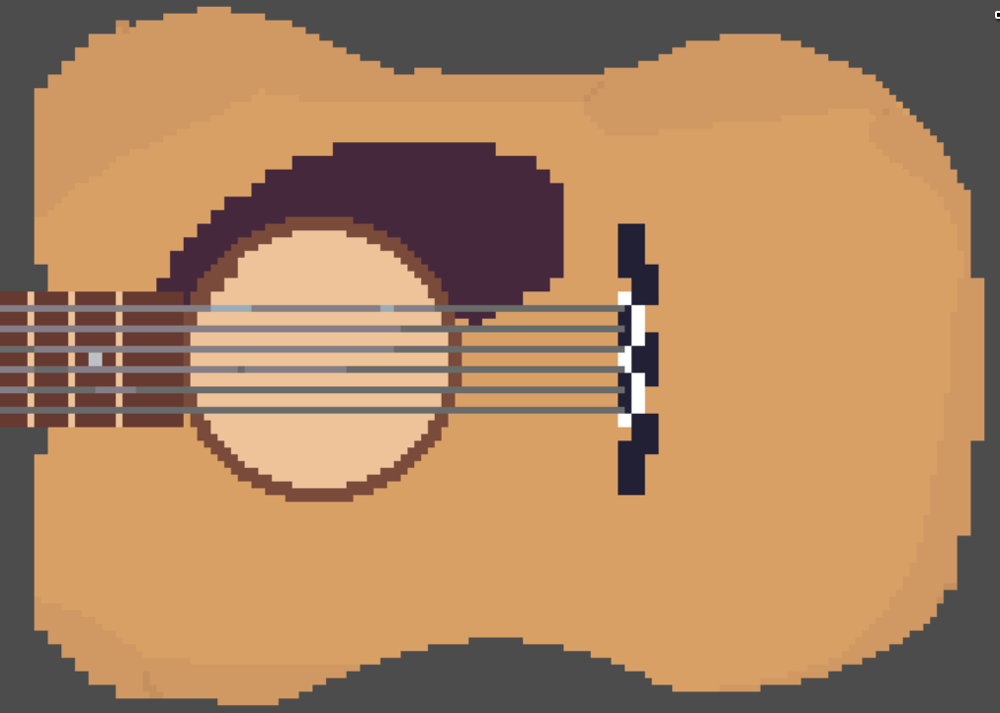
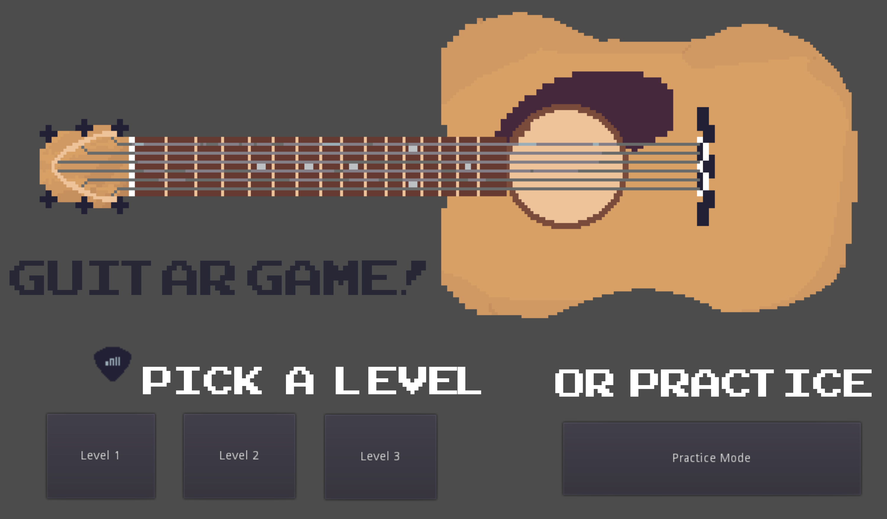
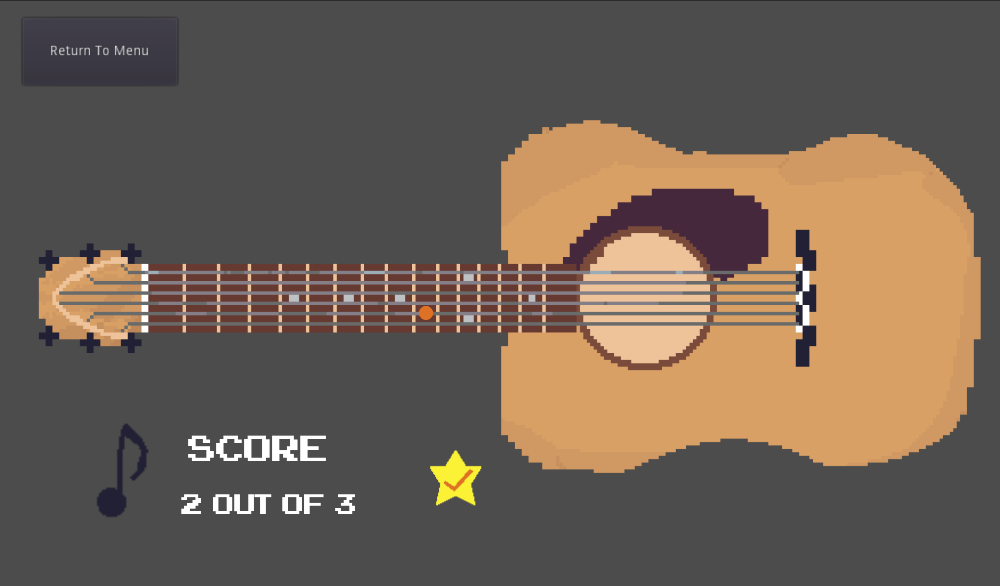
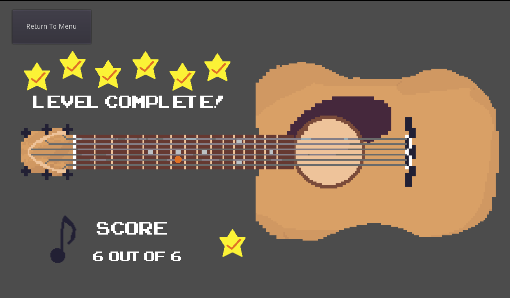

# Guitar Ear Trainer - 🌱 Hackbeanpot 2020 Finalist

## Context
> This was my project for Hackbeanpot 2020. Screenshots and my text submission are included below.

## Inspiration
I have been wanting to work on my ear note distinction for my guitar playing for a long time. Every time I play guitar however, I never feel like doing this kind of training because I can be playing songs instead. That's why I made an portable game so that I can practice it anywhere!

## What it does
Let's you improve your ears with three levels of increasing difficulty or with the randomly generated practice mode.

## How I built it
I drew the art for the project, spending most of my time there getting the guitar to look right. After that I spent a relatively short amount of time getting the guitar sample sounds for each note. The hardest work technically was wiring up the signals and designing the object structure within the object oriented game framework Godot.

## What's next for Guitar Ear Trainer
Scale practice, more songs and different guitar sounds!

## Screenshots

